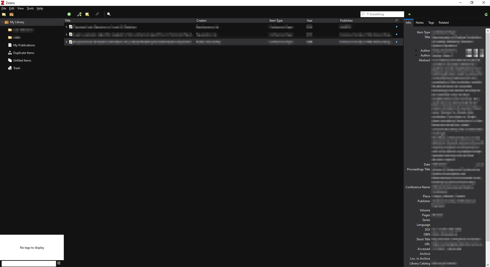

# Material Dark Theme for Zotero

## Introduction
userChrome.css file for a Zotero material dark theme. Fork of [Rosmaninho's Theme](https://github.com/notidentical/Zotero-Material-Dark-Theme), but following [Google Material Design's Guidelines](https://material.io/design).

Tested on Zotero versions 5-7. Tested on Windows 11, 10, and 7. Installation can be automatic or manual.

## Installation

### Automatic (Windows-only)
1. Run the file install.bat
2. Re-open Zotero

### Manual
1. Go to your user Profile folder 
   * Windows users: `C:\Users\User_name\AppData\Roaming\Zotero\Zotero\Profiles\user_profile.default\`
   * Linux (Flatpak) users: `~/.zotero/zotero/XXXXXXXX.default/`
2. Create a `chrome` folder
3. Place the `userChrome.css` file in there
4. Start Zotero and enjoy

## Main Changes from Original Repo
- Automatic installation alternative, for those that need to deploy it on multiple computers.
- Using darker colors <code>#121212</code> instead of <code>#323234</code>. Similar change for other dark colors.
- Using pure white with opacity for a gentler contrast 
- Fixes issues original code had with [CSS validator](https://jigsaw.w3.org/css-validator/validator)
